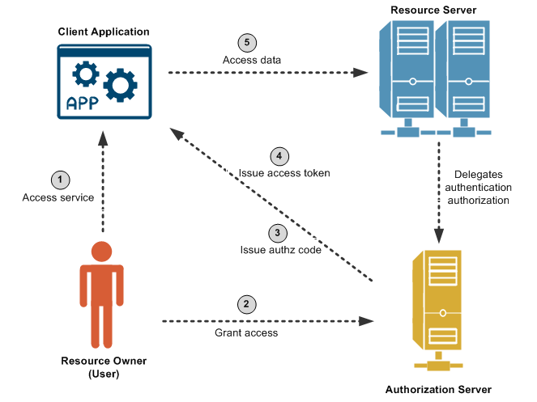

## Spring Security OAuth Authorization Server

### Relevant information:

This module demonstrates OAuth authorization flow using Spring Authorization Server, Spring OAuth Resource Server and
Spring OAuth Client.

We have broken this example into 3 micro-services to demonstrate the oauth functionality.

# Application Build

Please run below command in parent project

    mvn clean install

# Execution of the services with sequence

### spring-authorization-server execution

Windows User:

    cd spring-authorization-server
    mvn spring-boot:run

Linux Users:

    cd spring-authorization-server && mvn spring-boot:run

### resource-server execution
Windows User:

    cd resource-server
    mvn spring-boot:run

Linux User:

    cd resource-server && mvn spring-boot:run

### client-server execution
Windows User:

    cd client-server
    mvn spring-boot:run

Linux User:

    cd client-server && mvn spring-boot:run

# Test the application
- Go to [http://127.0.0.1:8080/articles](http://127.0.0.1:8080/articles)
- Enter the credentials `admin/password`
- The module uses the new OAuth stack with Java 11

### Relevant Articles:

- [Spring Security OAuth Authorization Server](https://www.baeldung.com/spring-security-oauth-auth-server)

### OAuth-2 with Authorization server, Resource server and client

